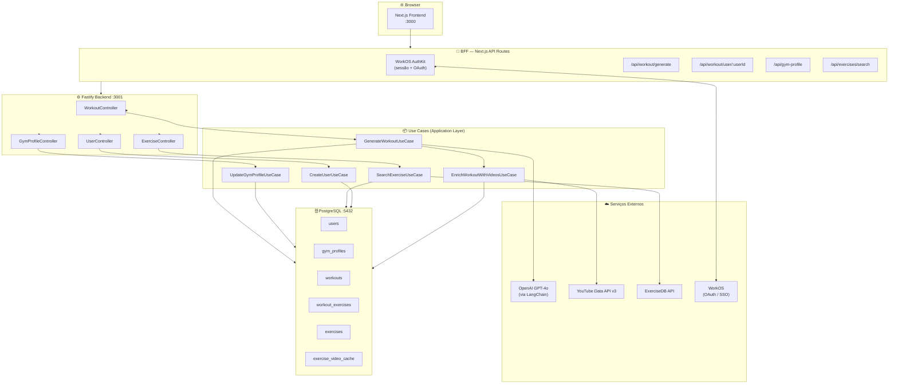
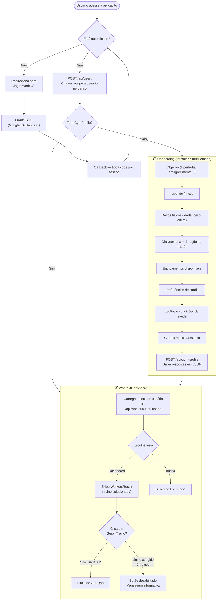
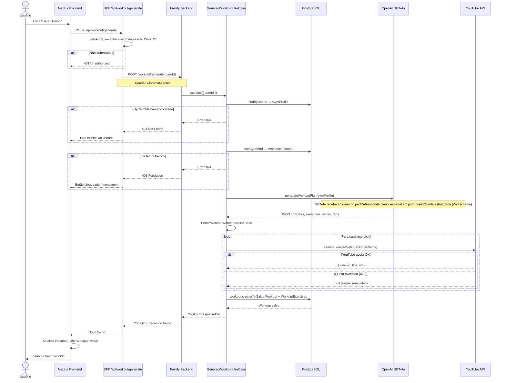
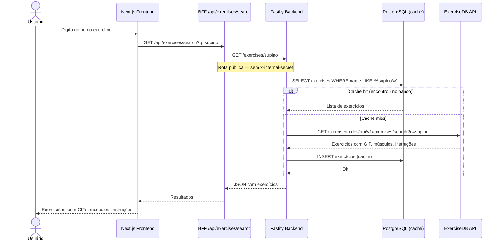
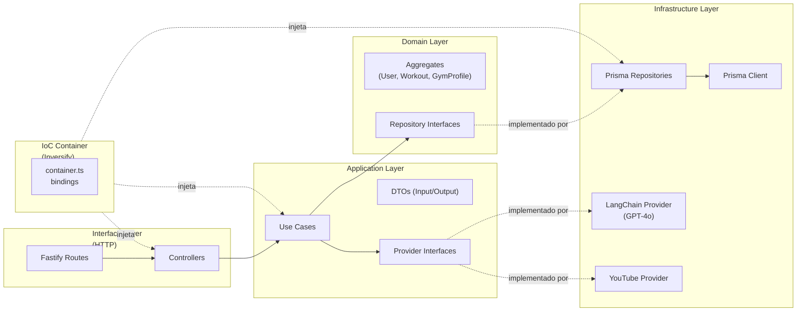
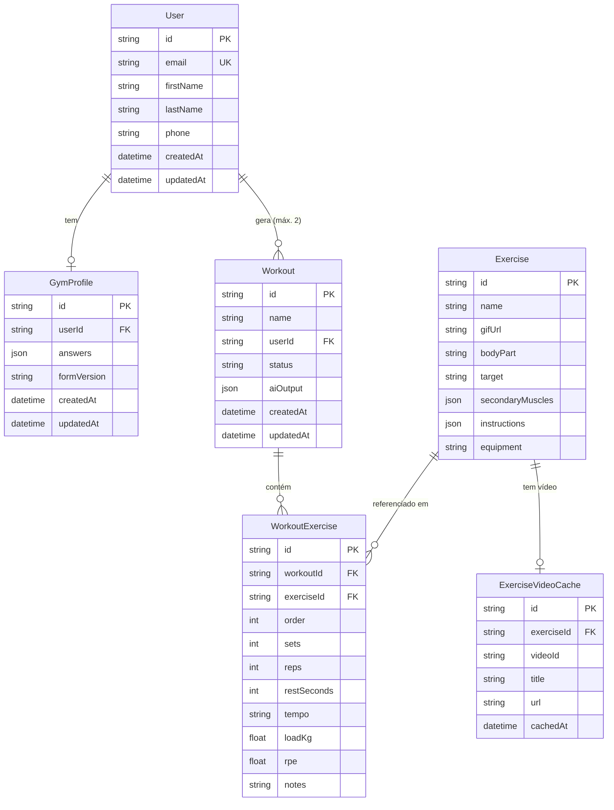

# Diagrama de Arquitetura e Fluxo — GymAI

---

## 1. Visão Geral dos Componentes



---

## 2. Jornada do Usuário (Fluxo Principal)



---

## 3. Fluxo de Geração de Treino (Detalhado)



---

## 4. Fluxo de Busca de Exercícios



---

## 5. Camadas da Aplicação (Backend DDD)



---

## 6. Modelo de Dados



---

## Resumo do Fluxo em Texto

```
1. LOGIN
   Usuário → WorkOS OAuth → sessão criada → usuário sincronizado no banco

2. ONBOARDING (apenas novos usuários)
   Formulário 8 etapas → respostas salvas como JSON no GymProfile

3. DASHBOARD
   Treinos carregados do banco → seleção e visualização

4. GERAR TREINO
   [BFF] Autentica sessão → extrai userId seguro
   [Backend] Valida GymProfile existe
   [Backend] Valida limite ≤ 2 treinos
   [GPT-4o] Gera plano semanal personalizado em PT-BR
   [YouTube] Enriquece cada exercício com link de vídeo
   [PostgreSQL] Persiste treino + exercícios
   [Frontend] Exibe resultado imediatamente

5. BUSCAR EXERCÍCIO
   Query → cache PostgreSQL (ExerciseDB) → retorna GIF + músculos + instruções
```
